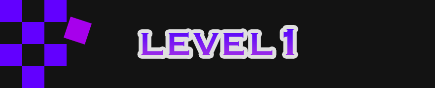

<h4 align="center">
  Game utility: Trigger a function after a set amount of game updates.
</h4>
<div align="center">
  
  
  
  
</div>

---

This library is like `setTimeout` (`l1.once`) and `setInterval` (`l1.repeat`) controlled by updates from a game loop.

This way, if you want to something to happen in your game after 60 updates, you just have to write:

```js
l1.once(() => {
  transitionToNextScreen();
}, 60);
```

In order for this to work, you need to call `l1.update` on every update. If you are using PixiJS this would mean that somewhere in your code you have to write:

```js
ticker.add(l1.update);
```

_These docs use `pixi.js` `ticker` as an example, but `level1` can be used with any game loop_

---

## API

### Basic

- [`l1.once(callback, [delay = 1])`](docs/once.md) - Run a callback function once after a delay.

TODO: Add example code here for easy copy paste

- [`l1.repeat(callback, [interval = 1])` ](docs/repeat.md) - Run a callback function repeatedly in an interval.

TODO: Add example code here for easy copy paste. Move the argument docs to the actual docs file

- [`update(deltaTime)`](docs/update.md) - Needs to be called on every game update.

### Advanced

- [`delay(delay)`](docs/delay.md) - Resolves a promise after a delay.

- [`sequence(callback, interval, list)`](docs/sequence.md) - Apply a callback to an item in a list every `interval` updates. Returns a promise that will be resolved once all items in the list have been processed.

### Utils

- [`get(id)`](docs/get.md) - Get one behavior by id

- [`getAll()`](docs/getAll.md) - Get all behaviors

- [`getByLabel(label)`](docs/getByLabel.md) - Get a list of behaviors with a label

- [`init(options)`](docs/init.md) - Configure level1

- [`remove(behavior)`](docs/remove.md)- Takes an `id` or `behavior` object. Marks the behavior for deletion. Will be deleted after all behaviors have been processed in the current game update.

---

## Install

**npm**

```
npm install l1
```

**yarn**

```
yarn add l1
```

---

## Getting started - once

TODO: Better examples

```js
import * as l1 from "l1";
import * as PIXI from "pixi.js";

const app = new PIXI.Application();

document.body.appendChild(app.view);

app.ticker.add(l1.update);

app.loader.load(() => {
  const square = new PIXI.Sprite(texture);
  app.stage.addChild(square);

  // Move 1 pixel every 3 ticks
  const move = l1.repeat(() => {
    square.x += 1;
    if (square.x > 500) {
      l1.remove("move");
    }
  }, 3);
  move.id = "move";
});
```

## repeat

---

## Recipes

### **Keep state between game updates**

Use a closure

```js
const move = () => {
  let x = 1;

  l1.repeat(() => {
    x += 1;
  });
};
```

### **Deleting behaviors**

`l1.remove` just marks the behavior for deletion, but it won't actually be deleted until the next update.

Therefore, you might need to wait a game update before you continue:

```js
const gameOver = () => {
  l1.remove("gameLoop");
  // `l1.once` ensures that the following code won't be executed until the `gameLoop` behavior has been deleted.
  l1.once(() => {
    // Continue doing stuff
  });
};
```

### **Log l1.update duration**

Use `performance.now`

```js
import * as l1 from "l1";

app.ticker.add((deltaTime) => {
  const before = performance.now();

  l1.update(deltaTime);

  const after = performance.now();
  const delta = after - before;
});
```

### **Log update duration averages**

### **Catch errors**

Wrap `l1.update` with a try catch

```js
import * as l1 from "l1";

app.ticker.add((deltaTime) => {
  try {
    l1.update(deltaTime);
  } catch (error) {
    console.error(error);
    logToExternalService(error);
  }
});
```

### **Disable logging**

`level1` prints warnings when you try to delete a behavior that doesn't exist. If you want to disable this, use `l1.init`

```js
import * as l1 from "l1";

l1.init({ logging: false });

app.ticker.add(l1.update);
```

---

## Other useful tools

[`juice.js`](https://github.com/rymdkraftverk/juice.js) - Make your animations look nicer

[`muncher`](https://github.com/sajmoni/muncher) - Generate sprite sheets from the command line

[`pixi-ex`](https://github.com/sajmoni/pixi-ex) - Pixi.js util functions

---

## Develop

### Custom commands

| Command        | Description                                |
| -------------- | ------------------------------------------ |
| `yarn build`   | Generate files in the `dist` folder        |
| `yarn clean`   | Remove the `dist` folder                   |
| `yarn lint`    | Run eslint on `src`                        |
| `yarn release` | Start the process to release a new version |

### Workflow

1. Make changes
2. `yarn build-test` - If all tests pass, proceed to the next step
3. Commit and `yarn release`
